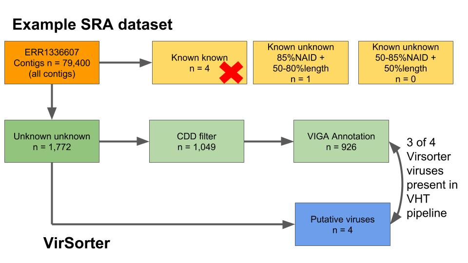

# Virus Genes 

Annotation of genes (including viral genes) can be based on similarity to other known genes or based on gene features (_ab initio_ prediction). 

Several programs or search models exist to determine putative genes (_ab inition_ predicition), such as `GeneMark` or `Prodigal`. As `GeneMark` is a licensed program, in this open-source project other software should be used (ie prodigal). Annotation by similarity is an standard feature of most of the programs that are regularly used. These similarity searches can either be based on basic scoring matrices, such as `BLAST` or `DIAMOND` or using probabilistic models, such `hidden-Markov models (HMM)`.  The most extensivly used, and still gold standard program is `HMMer`. `HMMer` requires one or multiple models to scan one or multiple sequnces. Interestingly, it allows to annotate distant orthologs, ideal for the discovery of viral ORF in NGS dark matter.

Ideally, a combination of both _ab initio_ gene prediction and gene annotation by similarity (alignment to a sequence or to a model) should annotate the contigs obtain during _de novo_ genome assembly.

## Ab initio gene profiling and gene annotation with VIGA pipeline

For a real annotation of viral ORFs in a given NGS, it is important to use a combined strategy, or pipeline, of annotation, in order to obtain as much information as possible. In this open-source project, it was decided to use an already existing pipeline: De novo VIral Genome Annotator or [VIGA](https://www.biorxiv.org/content/early/2018/03/07/277509).

VIGA is an automated pipeline that performes ab initio ORF profiling with Prodigal and gene annotation with Diamond, Blast and HMMER. It allows to uses multiple databases (i.e. RefSeq, pVOG, RVDB, etc).

All programs can be used through a [Docker image](https://hub.docker.com/r/vimalkvn/viga/)

```bash

docker pull vimalkvn/viga # All programs pre-install

```
Databases need to be manually downloaded and formatted. Additionally, BLAST, Diamond, Infernal and Hmmer should be install for formatting the databases.

```bash
# Create all databases
mkdir /data/databases
cd /data/databases

## rfam
mkdir rfam
cd rfam
curl -O ftp://ftp.ebi.ac.uk/pub/databases/Rfam/CURRENT/Rfam.cm.gz &> /dev/null
gunzip Rfam.cm.gz
# Before formatting the database, delete all but the first 2 instances, as we don't needed it in our pipeline, but VIGA requires it to launch as mandatory.
cmpress Rfam.cm &> /dev/null
cd ..

## RefSeq Viral Proteins
curl -O ftp://ftp.ncbi.nlm.nih.gov/refseq/release/viral/viral.1.protein.faa.gz &> /dev/null
curl -O ftp://ftp.ncbi.nlm.nih.gov/refseq/release/viral/viral.2.protein.faa.gz &> /dev/null
curl -O ftp://ftp.ncbi.nlm.nih.gov/refseq/release/viral/viral.3.protein.faa.gz &> /dev/null
gunzip viral.1.protein.faa.gz
gunzip viral.2.protein.faa.gz
gunzip viral.3.protein.faa.gz
cat viral.1.protein.faa viral.2.protein.faa viral.3.protein.faa > refseq_viral_proteins.faa
rm viral.1.protein.faa viral.2.protein.faa viral.3.protein.faa

## RefSeq Viral Proteins for DIAMOND
mkdir RefSeq_Viral_DIAMOND
cd RefSeq_Viral_DIAMOND
cp ../refseq_viral_proteins.faa .
diamond makedb --in refseq_viral_proteins.faa -d refseq_viral_proteins &> /dev/null
rm refseq_viral_proteins.faa
cd ..

## RefSeq Viral Proteins for BLAST
mkdir RefSeq_Viral_BLAST
cd RefSeq_Viral_BLAST
cp ../refseq_viral_proteins.faa .
makeblastdb -in refseq_viral_proteins.faa -dbtype prot -out refseq_viral_proteins &> /dev/null
rm refseq_viral_proteins.faa
cd ..
rm refseq_viral_proteins.faa

## pVOG and RVDB formatting

mkdir pvogs
cd pvogs
curl -O http://dmk-brain.ecn.uiowa.edu/VOG/downloads/All/AllvogHMMprofiles.tar.gz &> /dev/null
tar zxvf AllvogHMMprofiles.tar.gz &> /dev/null
{ echo AllvogHMMprofiles/*.hmm | xargs cat; } > pvogs.hmm
rm -rf AllvogHMMprofiles

wget https://rvdb-prot.pasteur.fr/files/U-RVDBv14.0-prot.hmm.bz2 
bzip2 -dk U-RVDBv14.0-prot.hmm.bz2
hmmconvert U-RVDBv14.0-prot.hmm > U-RVDBv14.0-prot3.hmm

cat pvogs.hmm U-RVDBv14.0-prot3.hmm > pvogs.hmm # unite pvogs and RVDBs for VIGA compatibility
hmmpress -f pvogs.hmm
cd ../..

```

VIGA has some specificities to be met:

- `run-viga` wrapper, `modifiers.txt` target `.fasta` or any other input file should be both in the current working directory.

- VIGA output has to be generated in the same working directory.

- Blast and Diamond perform correctly when multithreaded (option `--cpu` in VIGA), but Hmmer does not. Hmmer perfomes better with a high-memory single node.
 
To scale its usage to multiple contig files, a threading-controller was coded, being called as follows in the working directoy where all fasta files and the viga-wrapper is located:

```bash

./director.sh

```

Additionally, `director.sh` will call `unmapvigaannotations.pl`, `genbankfeature.py` and `unmapvigaannotations2.pl`, in this order, expand pVOG info and extract the translated ORF annotated in the VIGA `.gbk` output.

Fig. 1: 


All scripts should be located in the working directory. Scripts have `python2.X`, `biopython` and `pandas`, as dependencies.

Fig. 2: Example of dataset reduction though the pipeline



## Tutorial

In this tutorial, we will follow 2 SRAs `ERR1857044` and `ERR1913076` as examples of how this annotation pipeline works inside the general `Virus Hunt Toolkit` (VHT) hackathon.

From `DomainLabelling` sub-project, we will copy their output files `ERR1857044.passed.fasta` and `ERR1913076.passed.fasta` which correspond to contigs that have been labeled as non- bacterial, archeal or eukaryotic.

  1. Download the required databases, as shown before in this page.

  2. Copy the `.fasta` from #DomainLabeling example output (`ERR1857044.passed.fasta` and `ERR1913076.passed.fasta`) in your working directory or use  the content from here`VirusDiscovery/Virus/Genes/example/input/DomainLabelling/`.

  3. Modify the fasta headers to include the name of the SRA experiment, as to improve traceability:
  ```
  sed "s/>/>ERR1857044_/g" example_input/DomainLabelling/ERR1857044.passed.fasta > example_input/ERR1857044_passed_mod.fasta
  sed "s/>/>ERR1913076_/g" example_input/DomainLabelling/ERR1913076.passed.fasta > example_input/ERR1913076_passed_mod.fasta
  ```
  
  4. Copy `run-viga` into `example_input/`:
  ```
  cp run-viga example_input
  ```
  
  5. Move inside `example_input/` folder and run `scripts/director.sh` with `sudo` rights:
  ```
  cd example_input/
  sudo bash ../scripts/director.sh 
  ```
  `sudo` rights are indispensible for having all operational persmissions within the dockerized viga.
  
  6. After the computing time (~ 1h per SRA filtered contig file) the results of each SRA should be in the folder  `example_input/results`. Each SRA experiment will have its own folder, where several files can be found:
  ```
  ERR1857044_passed_mod.fasta # original fasta file
  ERR1857044_passed_mod_annotated.csv # annotation of fasta file in CSV format
  ERR1857044_passed_mod_annotated.fasta # predicted ORF from original fasta in nucleotides
  ERR1857044_passed_mod_annotated.gbk # # annotation of fasta file in Genbank format
  ERR1857044_passed_mod_annotated.protein.faa # predicted ORF from original fasta in aminoacids
  ERR1857044_passed_mod_annotated.protein_rename.faa # predicted ORF from original fasta in aminoacids with differnt name for VHT compatibility
  ERR1857044_passed_mod_annotated.tbl # annotation of fasta file in tabular format
  ERR1857044_passed_mod_annotated_rename.csv # annotation of fasta file in CSV format with differnt name for VHT compatibility
  ERR1857044_passed_mod_annotated_rename_vq.csv # annotation of fasta file in CSV format with differnt name for VHT compatibility with Viral Quocients from pVOGs added to the table
  ERR1857044_passed_mod_annotated_rename_vq.json # annotation of fasta file in CSV format with differnt name for VHT compatibility with Viral Quocients from pVOGs added to the table in JSON format for integration in VHT database
  logfile.txt # correspondance of internal VIGA ORF names and VHT ORF names
  modifiers.txt # modifiers of the project (none)
  run-viga # copy of the executable wrapper
  ```
  
