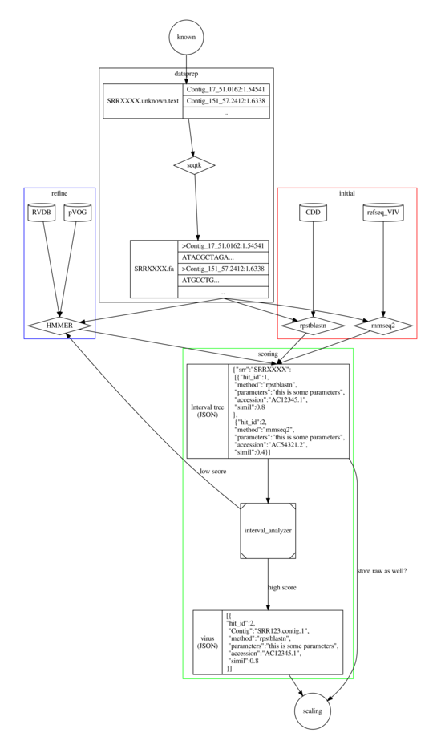

# Consolidation of novel hits

## Synopsis

In the last day of the Online Hackathon, we (well, at least I felt like it) got
flooded by several results from different databases and tools.

Screening novel contigs using different tools and target data bases results in
numerous hits which need to analyzed for putative viruses (because a definitive
answer still requires wet lab, if we like it or not).

To identify hits which contain more likely a novel virus we need to analyze all
hits and report them using a scoring or weighting system.

## Problem

Different tools report results in different ways and metrics. How to unify them
without writing a tool for each possible combination.

## Approach

We already use several tools, e.g. `rpstblastn`,  `HMMER`, `mmseq2`, which screen
several databases, e.g. `NCBI_VIV_proteins`, `nr`, `nt`, `pVOG`, `RVDB`.

These methods use different approaches,and in conjunction with different
databases, which we can incorporate in a simple scoring system, i.e. how often a
specific region within a contig has been found using a method and database.

This can be later extended by adding metadata, e.g. host, source organism of the
sequence which aligned to a contig, specificity of used database, etc.

## Idea
I propose we design a common, internal model for a putative hit which is used in
the analysis. This allows us to extract the required information from any
alignment result in any format (_You have results from tool X in format Y? Great,
parse it and return it as described here_). We take a page form **\#scaling**
team's playbook and use a similar data model (See below).
Thanks to Team Belgium *@Joan*, *@Warddem*, *@BertV* for their white board image.


## Technical

### Intervals

Each hit is an interval on a contig. We can use interval trees to store the
results from each SRR screen using a specific method and database (see below).
This allows to summarize the results, e.g. how many hits on contig X in region
N to N+100. Using metadata, we can score them.

Simple interval:
```
{
  "hitid": int,
  "start": int,
  "end": int
}
```

Extended interval:
```
{
 "hitid" : int,
 "start" : int,
 "end" : int,
 "db" : string,
 "method" : string,
 "bitscore" : 1471,
 "host" : int
}
```

### Cross referencing databases

### pVOGs

I looked at the [pVOG](http://dmk-brain.ecn.uiowa.edu/pVOGs/downloads/VOGTable.txt) table from *@David K*. It can be converted to a SQLite database to facilitate
querying pVOG results.

### NCBI Entrez

I wrote a simple tool (`VirusDiscoveryProject/novel/tools/result-reporter`) to
query the CDD database with *@Warddeb*'s test results
(`35.245.219.49:/home/jan.buchmann/work/warddeb-cdd-results.tbl`)[^1].

This can be extended to query all Entrez metadata. We can store fetched metadata
in one or several local SQLite databases to minimize look ups.


[^1]: The problem is, I need to figure out why the google cloud kills my requests
but are working on my local machine.